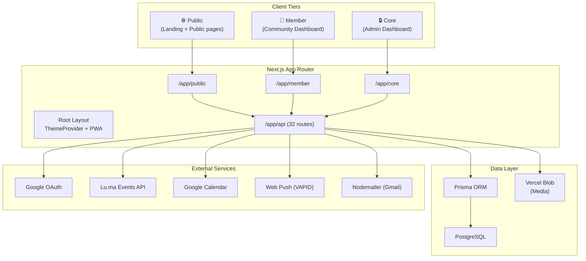
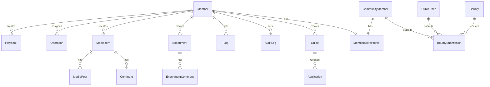
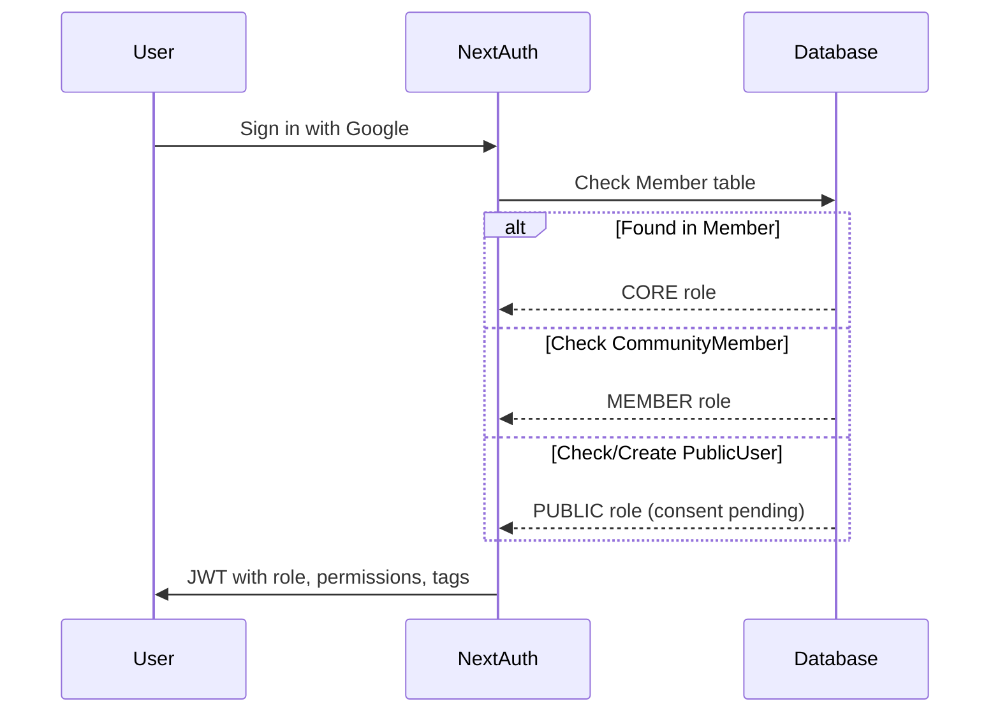

# Team1India — Codebase Analysis

## At a Glance

| Metric | Value |
|---|---|
| **Framework** | Next.js 16.1.1 (App Router) |
| **Language** | TypeScript 5 |
| **Styling** | Tailwind CSS v4 + Vanilla CSS |
| **Database** | PostgreSQL via Prisma 5.22 |
| **Auth** | NextAuth.js 4 (Google OAuth, JWT strategy) |
| **Deployment** | Vercel (with Vercel Analytics & Blob Storage) |
| **Source Files** | 338 `.ts`/`.tsx` files |
| **Lines of Code** | ~46,500 |
| **Prisma Models** | 25 models |
| **API Routes** | 32 endpoint groups |
| **PWA** | Full PWA with offline support, push notifications |

---

## 1. Architecture Overview



The app follows a **three-tier access model**:

| Tier | Route | Role Required | Access |
|---|---|---|---|
| **Public** | `/`, `/public/*` | None | Marketing site, events, public profiles, leaderboard |
| **Member** | `/member/*` | `MEMBER` or `CORE` | Dashboard, bounties, quests, experiments, content |
| **Core** | `/core/*` | `CORE` only | Full admin: members, media, operations, settings, monitoring |

---

## 2. Database Schema (25 Models)



### Key Model Groups

| Domain | Models | Purpose |
|---|---|---|
| **Identity** | `Member`, `CommunityMember`, `PublicUser`, `MemberExtraProfile` | Three-level user system with extended profiles |
| **Content** | `Playbook`, `ContentResource`, `Guide`, `MediaItem`, `MediaPost`, `Comment` | Rich content creation & media pipeline |
| **Operations** | `Operation`, `MeetingNote`, `ActionItem`, `AttendanceRecord` | Task tracking, meetings, attendance |
| **Community** | `Experiment`, `ExperimentComment`, `Poll`, `Announcement`, `Contribution` | Community engagement & ideation |
| **Gamification** | `Bounty`, `BountySubmission` | XP-based reward system for member engagement |
| **Events** | `LumaEvent` | Synced from Lu.ma API |
| **System** | `SystemSettings`, `TableConfig`, `Log`, `AuditLog`, `RateLimit`, `PushSubscription` | Config, logging, security |

> [!NOTE]
> All models use soft-delete via `deletedAt` field. All have proper composite/single-column indexes.

---

## 3. Authentication & Authorization

### Auth Flow (NextAuth.js + Google OAuth)



**Key Design Decisions:**
- Role is determined by **which table** the user's email exists in — not by a role field
- `Member` → `CORE`, `CommunityMember` → `MEMBER`, `PublicUser` → `PUBLIC`
- JWT strategy with 30-day session lifetime
- Granular permissions via JSON field: `{ "resource": "READ|WRITE|FULL_ACCESS" }`
- Wildcard permission support: `{ "*": "FULL_ACCESS" }`
- Explicit `DENY` check for defense-in-depth

### Route Protection

| Layer | Mechanism |
|---|---|
| `/core/*` layout | Server-side `getServerSession()` → role check → redirect |
| `/member/*` layout | Server-side session check → `MEMBER` or `CORE` required |
| API routes | Per-route `checkCoreAccess()` + permission checks |
| Rate limiting | DB-backed (`RateLimit` model), fail-open strategy |

---

## 4. API Surface (32 Route Groups)

| Category | Endpoints | Auth |
|---|---|---|
| **Data Management** | `data-grid`, `members`, `community-members` | CORE |
| **Content** | `content`, `announcements`, `playbooks`, `guides`, `notes` | CORE/MEMBER |
| **Operations** | `operations`, `action-items`, `attendance`, `logs` | CORE |
| **Community** | `experiments`, `polls`, `contributions`, `leaderboard`, `bounty` | Mixed |
| **Events** | `luma-events`, `event-feedback` | Mixed |
| **Media** | `media`, `mediakit`, `upload` | CORE |
| **User** | `profile`, `applications` | Authenticated |
| **System** | `admin`, `settings`, `cron`, `push`, `seed` | CORE/System |
| **Public** | `public/*` | None |

---

## 5. Frontend Architecture

### Component Organization (~70 components)

```
components/
├── auth/              # Sign-in UI
├── bounty/            # BountyBuilder (admin)
├── calendar/          # Date picker, schedule meeting
├── core/              # CoreWrapper, CorePageHeader, admin tools
│   └── admin/         # Admin-specific CRUD panels
├── data-grid/         # DataGrid (33KB — the powerhouse component)
├── demos/             # Demo/example components
├── examples/          # More example/reference components
├── form-builder/      # Dynamic form builder
├── guides/            # Guide viewer/editor
├── media/             # Media pipeline components
├── member/            # MemberDashboard, BountyBoard, ContributionModal
├── playbooks/         # Playbook viewer
├── public/            # Public-facing components
├── ui/                # Shared UI: Modal, Toast, Preloader, effects
└── website/           # Marketing: Hero, Navbar, Footer, Events, Impact
```

### Standout Patterns

- **DataGrid** ([DataGrid.tsx](file:///Users/sarnavo/Development/Team1India/components/data-grid/DataGrid.tsx)) — A 33KB generic table component with sorting, filtering, CRUD, column config persistence via `TableConfig` DB model
- **Dynamic imports** — Heavy landing page sections (`Impact`, `Events`, `Programs`, `GetInvolved`) are lazy-loaded
- **PWA components** — `PWAInstallPrompt`, `PWAUpdatePrompt`, `OfflineSyncStatus`, `NotificationPermissionPrompt`
- **Visual effects** — `etheral-shadow.tsx`, `falling-pattern.tsx`, `DynamicBackground.tsx`

---

## 6. PWA & Offline Capabilities

The app has a **production-grade PWA setup**:

| Feature | Implementation |
|---|---|
| Service Worker | `@ducanh2912/next-pwa` with Workbox |
| Offline Fallback | `/offline` route |
| Push Notifications | VAPID-based via `web-push`, custom `push-sw.js` |
| Caching Strategy | Route-aware: NetworkOnly for auth APIs, CacheFirst for images, StaleWhileRevalidate for public pages |
| Background Sync | Custom `backgroundSync.ts` with conflict resolution |
| Cross-Tab Sync | `crossTabSync.ts` for multi-tab state coordination |
| Offline Storage | IndexedDB via `idb` library |
| Analytics | Offline-aware analytics with `offlineAnalytics.ts` |
| Monitoring | `pwaMonitoring.ts` + `CacheMonitoringPanel` component |

> [!IMPORTANT]
> PWA is disabled in development (`disable: process.env.NODE_ENV === "development"`). The service worker uses `skipWaiting: false` to let users control updates via `PWAUpdatePrompt`.

---

## 7. External Integrations

| Service | Library/API | Purpose |
|---|---|---|
| **Google OAuth** | `next-auth` + `google-auth-library` | Authentication |
| **Google Calendar** | Custom `google-calendar.ts` | Meeting scheduling from admin |
| **Lu.ma** | REST API via `luma.ts` | Event sync |
| **Vercel Blob** | `@vercel/blob` | Media file storage |
| **Vercel Analytics** | `@vercel/analytics` | Page analytics |
| **Web Push** | `web-push` | Browser push notifications |
| **Gmail** | `nodemailer` | Transactional emails (26KB email module) |

---

## 8. Security Posture

### ✅ Strengths

| Area | Detail |
|---|---|
| **Headers** | Full security headers: HSTS, CSP, X-Frame-Options, X-XSS-Protection, nosniff |
| **CSP** | Strict Content-Security-Policy with explicit source allowlists |
| **Cookies** | `__Secure-` / `__Host-` prefixed in production, `httpOnly`, `sameSite: lax` |
| **Auth APIs** | Never cached by service worker (`NetworkOnly`) |
| **Blob caching** | Vercel Blob images bypass cache (`NetworkOnly`) to avoid opaque responses |
| **Soft deletes** | All models use `deletedAt` — data is never hard-deleted |
| **Rate limiting** | DB-backed rate limiter with proper `429` responses and `Retry-After` headers |
| **Audit logging** | `AuditLog` model tracks CREATE/UPDATE/DELETE with metadata diffs |
| **Permission system** | Resource-level granular permissions with explicit DENY support |

### ⚠️ Concerns

| Area | Detail | Severity |
|---|---|---|
| **`@ts-ignore` usage** | 6+ occurrences in auth flow suppressing type checks | Medium |
| **`any` casts** | `session.user as any` is used across layouts and auth | Medium |
| **Rate limit fail-open** | If DB is down, rate limiter allows all traffic (intentional but risky) | Low |
| **`unsafe-eval` in CSP** | Present in `script-src` — broadens attack surface | Medium |
| **No middleware.ts** | Route protection is purely layout-based; no edge middleware for early rejection | Medium |
| **`signupIp` placeholder** | Set to `"next-auth-signin"` string instead of actual IP | Low |

---

## 9. Styling & Design System

| Aspect | Detail |
|---|---|
| **Framework** | Tailwind CSS v4 with PostCSS |
| **Font** | Kanit (Google Fonts) — weights 400–700 |
| **Brand Color** | `#ff394a` (Red) — mapped to `brand-*`, plus overrides for `indigo`, `violet`, `blue` |
| **Theme** | Dark-first (`defaultTheme="dark"`) via `next-themes` |
| **Dark Mode** | `bg-black` / `text-white` foundation with `zinc-900` dashboard surfaces |
| **Effects** | Ethereal shadow, falling patterns, glassmorphism borders (`white/10`) |
| **Safe Area** | Full `env(safe-area-inset-*)` support for PWA |

> [!TIP]
> The color aliasing strategy (mapping `indigo`, `violet`, `blue` → brand red) means any Tailwind utility using these colors automatically uses the brand palette. Clever but could confuse new contributors.

---

## 10. Key Observations & Recommendations

### Architecture Strengths
1. **Clean three-tier separation** — Public/Member/Core with layout-level access control
2. **Feature-rich PWA** — Offline storage, background sync, cross-tab sync, push notifications
3. **Comprehensive audit trail** — AuditLog + Log models with metadata
4. **Flexible data model** — `customFields` JSON columns on most models allow schema-free extensions
5. **Sophisticated caching** — Route-aware service worker caching with explicit auth-exclusion

### Areas for Improvement

| Priority | Area | Recommendation |
|---|---|---|
| 🔴 High | **Type Safety** | Replace `@ts-ignore` and `as any` casts in auth with proper type augmentation in `next-auth.d.ts` |
| 🔴 High | **Middleware** | Add `middleware.ts` for edge-level route protection instead of relying solely on layout checks |
| 🟡 Medium | **DataGrid size** | 33KB single component — consider splitting into sub-components (Table, Filters, ColumnConfig, CRUD) |
| 🟡 Medium | **CSP `unsafe-eval`** | Remove if possible; investigate which dependency requires it |
| 🟡 Medium | **Email module** | 26KB `email.ts` — consider splitting into template files |
| 🟢 Low | **Code organization** | Some components are very large (BountyBoard 37KB, MemberDashboard 23KB) — splitting would improve maintainability |
| 🟢 Low | **Missing `og-image.png`** | Referenced in metadata but not found in `/public` |
| 🟢 Low | **Unused `windowStart`** | In `rate-limit.ts` line 32, `windowStart` is computed but never used |

---

## 11. File Size Hotspots

| File | Size | Notes |
|---|---|---|
| [BountyBoard.tsx](file:///Users/sarnavo/Development/Team1India/components/member/BountyBoard.tsx) | 37KB | Largest component — candidate for decomposition |
| [DataGrid.tsx](file:///Users/sarnavo/Development/Team1India/components/data-grid/DataGrid.tsx) | 33KB | Generic CRUD table — powerful but monolithic |
| [email.ts](file:///Users/sarnavo/Development/Team1India/lib/email.ts) | 26KB | Email templates inline — should extract |
| [MemberDashboard.tsx](file:///Users/sarnavo/Development/Team1India/components/member/MemberDashboard.tsx) | 24KB | Dashboard with many inline sections |
| [ContributionModal.tsx](file:///Users/sarnavo/Development/Team1India/components/member/ContributionModal.tsx) | 21KB | Multi-step form — complex but functional |
| [core/page.tsx](file:///Users/sarnavo/Development/Team1India/app/core/page.tsx) | 19KB | Admin dashboard homepage |
| [ScheduleMeetingModal.tsx](file:///Users/sarnavo/Development/Team1India/components/core/ScheduleMeetingModal.tsx) | 17KB | Google Calendar integration |
| [schema.prisma](file:///Users/sarnavo/Development/Team1India/prisma/schema.prisma) | 17KB | 25 models, 615 lines |

---

## 12. Summary

**Team1India** is a full-featured community management platform with a well-thought-out architecture. The three-tier role system, comprehensive PWA support, and audit infrastructure demonstrate production-level engineering. The main technical debt areas are type safety in the auth layer, oversized components, and missing edge middleware. The codebase is well-indexed at the database level and uses sensible caching strategies.
