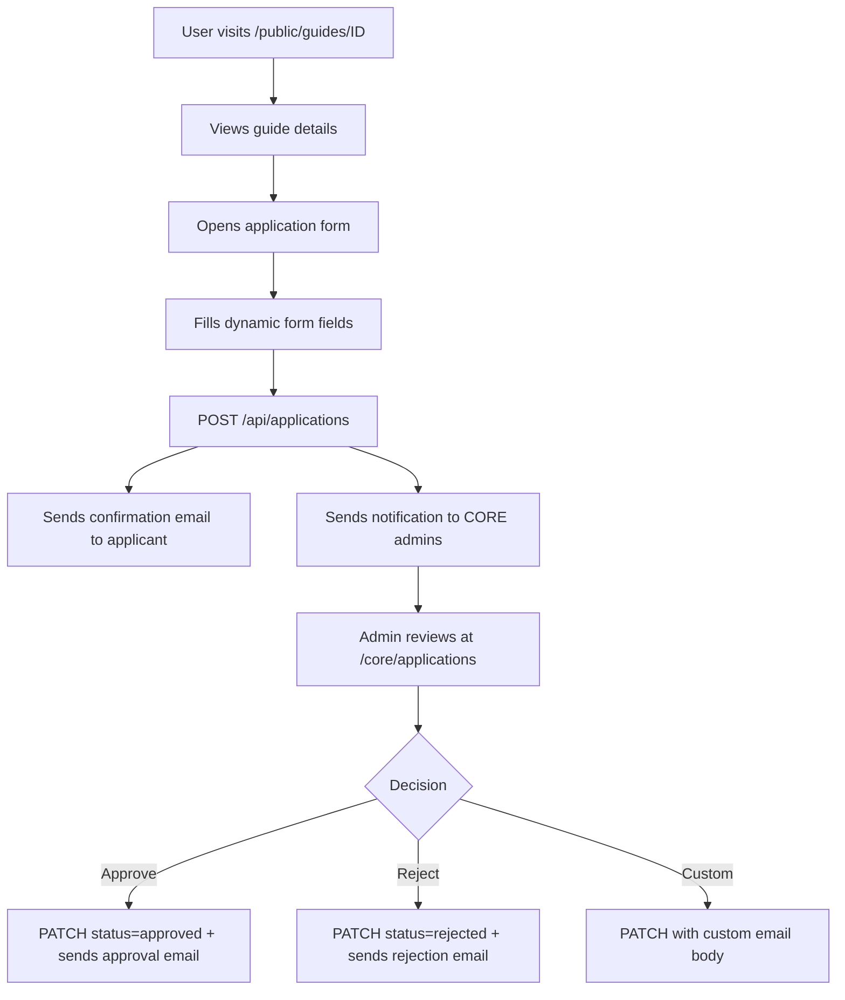
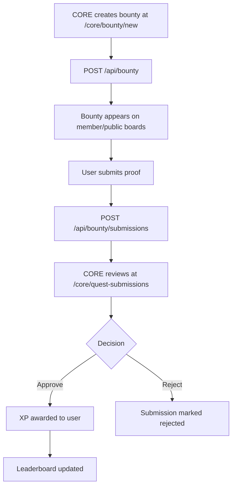
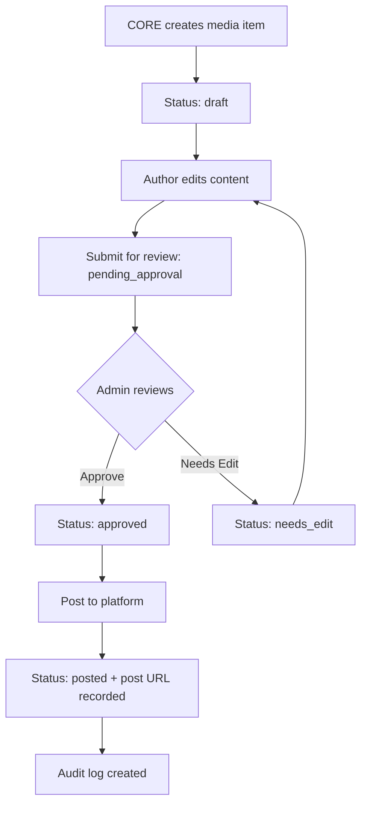
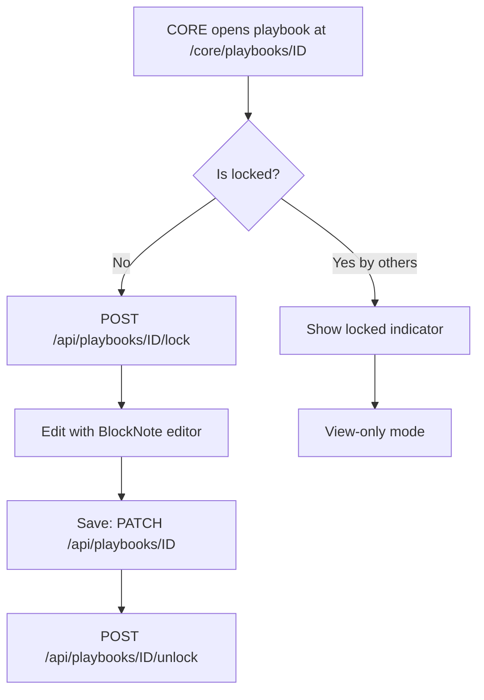
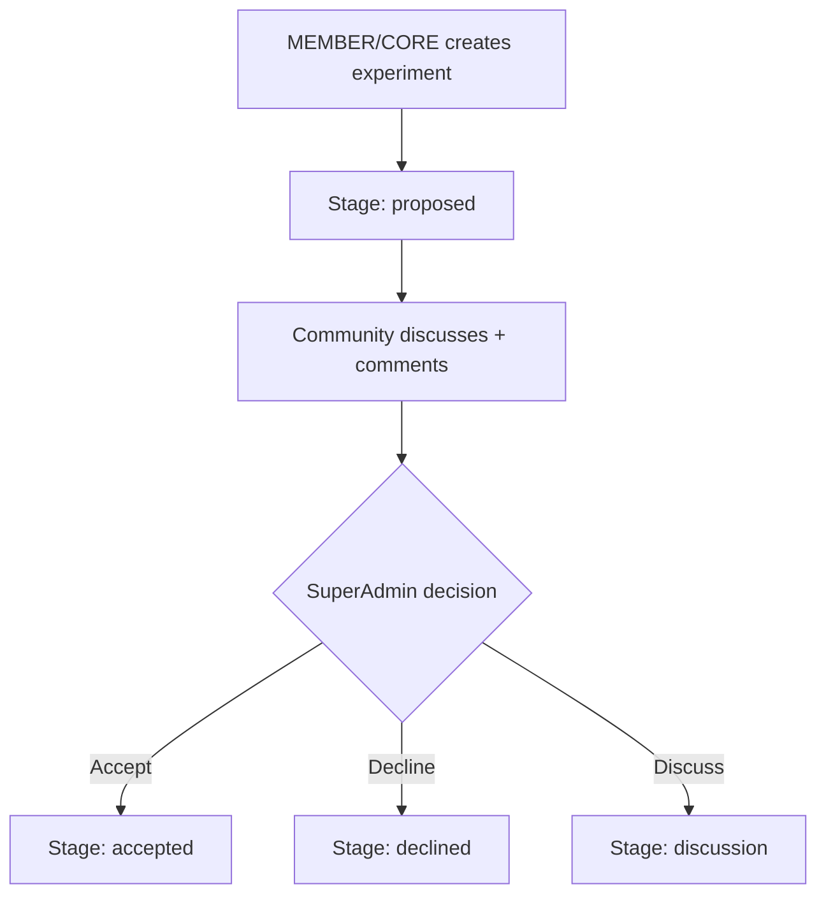
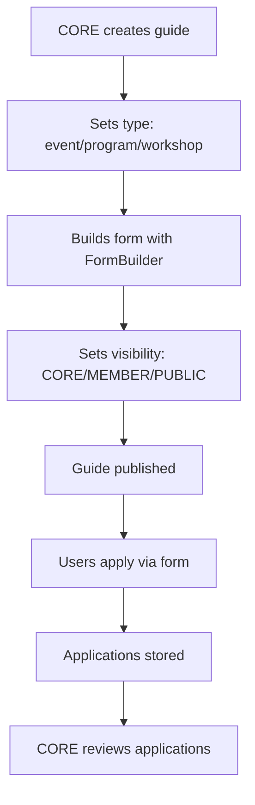

# Team1India — Routes & Flows

> Auto-generated from codebase analysis (2026-04-22)

---

## 1. Route Architecture

```
app/
├── page.tsx                          # Landing page (website homepage)
├── layout.tsx                        # Root layout (providers, fonts, theme)
├── auth/signin/page.tsx              # Custom NextAuth sign-in page
├── access-check/page.tsx             # Role/permission debugging page
├── offline/page.tsx                  # PWA offline fallback
│
├── public/                           # 🌐 PUBLIC tier (anyone, even unauthenticated)
│   ├── page.tsx                      # Public dashboard/landing
│   ├── bounty/page.tsx               # Public bounty board
│   ├── content/page.tsx              # Public content listing
│   ├── events/page.tsx               # Public events listing
│   ├── events/[id]/page.tsx          # Single event detail
│   ├── guides/[id]/page.tsx          # Single guide (application form)
│   ├── leaderboard/page.tsx          # Public XP leaderboard
│   ├── playbooks/page.tsx            # Public playbooks listing
│   ├── playbooks/[id]/page.tsx       # Single playbook reader
│   ├── profile/page.tsx              # Public user profile editor
│   ├── programs/page.tsx             # Public programs listing
│   └── programs/[id]/page.tsx        # Single program detail
│
├── member/                           # 👥 MEMBER tier (CommunityMember + CORE)
│   ├── layout.tsx                    # Auth guard: MEMBER || CORE
│   ├── page.tsx                      # Member dashboard
│   ├── announcements/page.tsx        # Member announcements
│   ├── bounty/page.tsx               # Member bounty board
│   ├── content/page.tsx              # Member content listing
│   ├── content/[id]/page.tsx         # Single content detail
│   ├── directory/page.tsx            # Member directory
│   ├── events/page.tsx               # Member events
│   ├── events/[id]/page.tsx          # Single event
│   ├── experiments/page.tsx          # Experiments listing
│   ├── experiments/new/page.tsx      # Create experiment
│   ├── experiments/[id]/page.tsx     # Single experiment
│   ├── leaderboard/page.tsx          # Member leaderboard
│   ├── playbooks/page.tsx            # Member playbooks
│   ├── playbooks/[id]/page.tsx       # Single playbook
│   ├── profile/page.tsx              # Member profile editor
│   ├── programs/page.tsx             # Member programs
│   ├── programs/[id]/page.tsx        # Single program
│   └── submit-quest/page.tsx         # Quest submission form
│
├── core/                             # 🛡️ CORE tier (Core Team only)
│   ├── layout.tsx                    # Auth guard: CORE only
│   ├── page.tsx                      # Core dashboard
│   ├── admin/                        # Admin panel
│   │   ├── layout.tsx                # Admin sidebar layout
│   │   └── page.tsx                  # Admin dashboard
│   ├── announcements/page.tsx        # Manage announcements
│   ├── applications/page.tsx         # Review all applications
│   ├── attendance/page.tsx           # Attendance tracker
│   ├── bounty/page.tsx               # Manage bounties
│   ├── bounty/new/page.tsx           # Create bounty
│   ├── campaigns/page.tsx            # Campaign management
│   ├── campaigns/new/page.tsx        # Create campaign
│   ├── campaigns/[id]/page.tsx       # Edit campaign
│   ├── content/page.tsx              # Content management
│   ├── content/guides/page.tsx       # Content guides list
│   ├── content/guides/new/page.tsx   # Create content guide
│   ├── content/guides/[id]/page.tsx  # View content guide
│   ├── content/guides/[id]/edit/     # Edit content guide
│   ├── events/page.tsx               # Events management
│   ├── events/guides/page.tsx        # Event guides list
│   ├── events/guides/new/page.tsx    # Create event guide
│   ├── events/guides/[id]/page.tsx   # View event guide
│   ├── events/guides/[id]/edit/      # Edit event guide
│   ├── event-feedback/page.tsx       # Feedback campaigns
│   ├── event-feedback/new/page.tsx   # Create feedback campaign
│   ├── event-feedback/[id]/page.tsx  # View feedback results
│   ├── experiments/page.tsx          # Manage experiments
│   ├── experiments/new/page.tsx      # Create experiment
│   ├── experiments/[id]/page.tsx     # View experiment
│   ├── logs/page.tsx                 # Activity logs viewer
│   ├── media/page.tsx                # Media pipeline
│   ├── mediakit/page.tsx             # Media kit manager
│   ├── mediakit/new/page.tsx         # Create media kit asset
│   ├── members/page.tsx              # Member management
│   ├── members/[id]/page.tsx         # Member detail/permissions
│   ├── members/layout.tsx            # Members section layout
│   ├── monitoring/page.tsx           # System monitoring
│   ├── notes/page.tsx                # Meeting notes
│   ├── operations/page.tsx           # Task/operation management
│   ├── partners/page.tsx             # Partner management
│   ├── playbooks/page.tsx            # Playbook editor
│   ├── playbooks/[id]/page.tsx       # Edit single playbook
│   ├── poll/page.tsx                 # Poll management
│   ├── profile/page.tsx              # Core member profile
│   ├── programs/page.tsx             # Programs management
│   ├── programs/guides/page.tsx      # Program guides list
│   ├── programs/guides/new/page.tsx  # Create program guide
│   ├── programs/guides/[id]/page.tsx # View program guide
│   ├── programs/guides/[id]/edit/    # Edit program guide
│   ├── projects/page.tsx             # Project management
│   ├── quest-submissions/page.tsx    # Quest submission review
│   └── settings/page.tsx             # System settings
│
├── campaign/[id]/page.tsx            # Public campaign page
├── event-feedback/[slug]/page.tsx    # Public event feedback form
├── hackathon/[id]/page.tsx           # Public hackathon page
└── workshop/[id]/page.tsx            # Public workshop page
```

---

## 2. User Flows

### Flow A: Public User Registration

```mermaid
flowchart TD
    A[Visit site] --> B[Click Sign In]
    B --> C[Google OAuth]
    C --> D{Email in Member table?}
    D -->|Yes| E[Login as CORE]
    D -->|No| F{Email in CommunityMember?}
    F -->|Yes| G[Login as MEMBER]
    F -->|No| H{Email in PublicUser?}
    H -->|Yes| I[Login as PUBLIC]
    H -->|No| J[Create PublicUser]
    J --> K[Show Consent Modal]
    K --> I
    I --> L[/public dashboard]
```

### Flow B: Application Submission



### Flow C: Bounty Lifecycle



### Flow D: Media Pipeline



### Flow E: Playbook Editing (Collaborative)



### Flow F: Experiment/Proposal



### Flow G: Guide System (Events/Programs/Workshops)



---

## 3. Layout Hierarchy

```
RootLayout (app/layout.tsx)
├── Providers (SessionProvider, ThemeProvider)
├── Font loading (Inter)
├── PWAInstallPrompt
├── Vercel Analytics
│
├── CoreLayout (app/core/layout.tsx)
│   ├── Guard: session + role === CORE
│   ├── NotificationPermissionPrompt
│   └── PWAUpdatePrompt
│
├── MemberLayout (app/member/layout.tsx)
│   └── Guard: session + role in [MEMBER, CORE]
│
└── Public pages (no layout guard)
    └── Accessible to all
```

---

## 4. Navigation Structure

### Core Dashboard (`/core`)
- Dashboard Home → Members → Operations → Playbooks → Media → Experiments
- Content → Events → Programs → Guides (each with sub-routes)
- Admin → Logs → Settings → Monitoring → Attendance
- Announcements → Polls → Meeting Notes → Action Items

### Member Dashboard (`/member`)
- Dashboard Home → Directory → Bounty → Experiments
- Content → Events → Programs → Playbooks
- Leaderboard → Profile → Submit Quest

### Public Site (`/public`)
- Landing → Events → Programs → Playbooks → Content
- Bounty Board → Leaderboard → Profile
- Guide Application Forms

---

## 5. Special Routes

| Route | Purpose |
|---|---|
| `/` | Marketing homepage (SSR) |
| `/auth/signin` | Custom NextAuth sign-in page |
| `/access-check` | Debug page showing user's role + permissions |
| `/offline` | PWA offline fallback page |
| `/campaign/[id]` | Public campaign landing pages |
| `/event-feedback/[slug]` | Public feedback collection forms |
| `/hackathon/[id]` | Public hackathon pages |
| `/workshop/[id]` | Public workshop pages |
